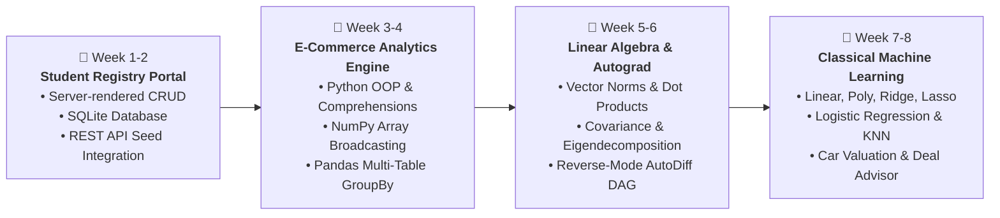

# Hack-o-Week Odd Semester Session 2026-2027

Welcome to the **Hack-o-Week** repository for the Odd Semester Session. This repository contains weekly data engineering, web applications, machine learning foundations, and analytics projects developed week-by-week.

---

## 🛠️ Global Technology Stack

---

## 🗺️ Weekly Curriculum Roadmap

---

## 📂 Repository Index & Subfolders

### 1. [week 1-2/](file:///e:/Hack-o-Week-Odd-Semester-Session-2026-2027/week%201-2) — Student Registry & Database CRUD Portal
- **Description**: Server-rendered Flask web application managing academic roll lists and student profiles with zero client-side JavaScript.
- **Key Features**: Live search filtering, dynamic admission date formatting, SQLite database persistence, and RandomUser API seed integration.

### 2. [week 3-4/](file:///e:/Hack-o-Week-Odd-Semester-Session-2026-2027/week%203-4) — Global E-Commerce Data Analytics & Visualization Engine
- **Description**: Python data engineering pipeline analyzing 397,000+ transaction records across 4,300+ customers using real relational datasets.
- **Key Features**:
  - **Python OOP & Comprehensions**: Modular architecture (`DataLoader`, `DataCleaner`, `SalesAnalyticsEngine`, `DataVisualizer`) with list/dict comprehensions.
  - **NumPy Array Vectorization & Broadcasting**: Array math (`np.multiply`), Z-score normalization `(price - mean) / std`, and RFM matrix dot products (`np.dot`).
  - **Pandas DataFrames & GroupBy**: 3-table SQL-style inner joins and multi-level GroupBy statistical aggregations.
  - **Data Visualizations**: High-resolution Seaborn and Matplotlib exports (Heatmaps, Violin Plots, Bar Charts, Line Dashboards).

### 3. [week 5-6/](file:///e:/Hack-o-Week-Odd-Semester-Session-2026-2027/week%205-6) — Linear Algebra & Calculus Engine for Machine Learning
- **Description**: Mathematics, linear algebra, and automatic differentiation (Autograd) system built from scratch in Python applied to the Hotel Booking Demand & Cancellation dataset (119,390 records).
- **Key Features**:
  - **Linear Algebra**: Feature vector $L_2$ norms, dot product cosine similarity matrices, covariance matrix ($\mathbf{\Sigma} = \frac{1}{N-1}\mathbf{X}^T\mathbf{X}$), spectral eigendecomposition ($\mathbf{\Sigma}\mathbf{v} = \lambda\mathbf{v}$), power iteration, and 2D PCA projection.
  - **Calculus & Autograd DAG**: Custom scalar `Value` computational graph, forward activations, analytical reverse-mode automatic differentiation using the Multivariate Chain Rule, and central finite difference gradient checking ($< 10^{-10}$ error).
  - **From-Scratch Neural Network**: Multi-Layer Perceptron (MLP) trained via pure backpropagation and SGD for cancellation prediction with loss curves and decision boundary plots.
  - **Diagnostic Visualizations**: High-resolution exports (Vector similarity heatmap, Covariance scree plot, PCA projection scatter, Gradient flow validation, Decision boundary surface).

### 4. [week 7-8/](file:///e:/Hack-o-Week-Odd-Semester-Session-2026-2027/week%207-8) — Classical Machine Learning Suite: Regression & Classification
- **Description**: Comprehensive machine learning suite covering classical Regression and Classification algorithms applied to the Used Car Resale Market Dataset (6,000 records).
- **Key Features**:
  - **Regression Suite**: Linear Regression (OLS & Normal Equation), Polynomial Regression (Degree 2, capturing non-linear depreciation and bias-variance tradeoff, $R^2 = 0.9318$), Ridge Regression ($L_2$ shrinkage), and Lasso Regression ($L_1$ coordinate descent feature sparsity).
  - **Classification Suite**: Logistic Regression (Binary Cross-Entropy, 79.92% accuracy, 0.835 ROC-AUC) and K-Nearest Neighbors (KNN with $k$-hyperparameter tuning).
  - **Real-World Decision Support**: Interactive Car Valuation & Deal Advisor evaluating specific vehicle buyer profiles and scoring deal quality.
  - **Diagnostic Visualizations**: 5 high-resolution figures (Depreciation curves, Ridge vs Lasso regularization paths, ROC/Confusion Matrix, KNN decision surface, Benchmark leaderboard).

---

Made by [Dhanish Ladwani](https://github.com/dhanish0711/)
